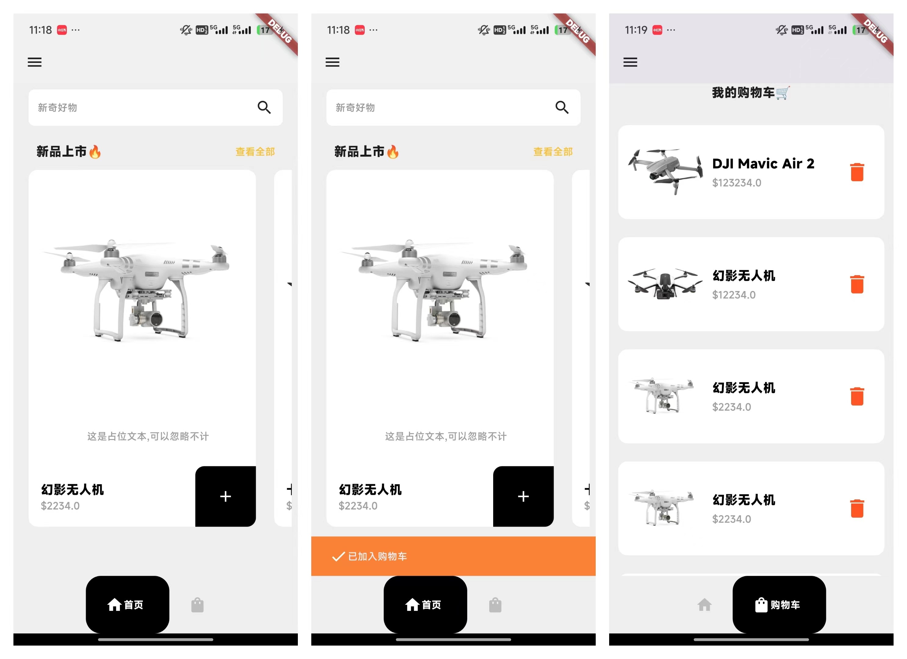

# flutter_shop_app


## 介绍
该项目学习来源于Mitch Koko博主的flutter2小时快速入门课程中的一个案例,通过从0到1搭建一个简易的购物车项目,展示了如何使用provider全局状态管理,各个布局之前的嵌套使用,等等相关知识.

## 效果



## 学习地址:
- https://www.youtube.com/watch?v=HQ_ytw58tC4&t=3270s


## 项目使用:

1. 拉取
```shell
git clone git@github.com:SunFei123456/flutter_shop_app.git
```

2. 安装依赖
```shell
flutter pub get
```

3. 运行
```shell
flutter run
```
